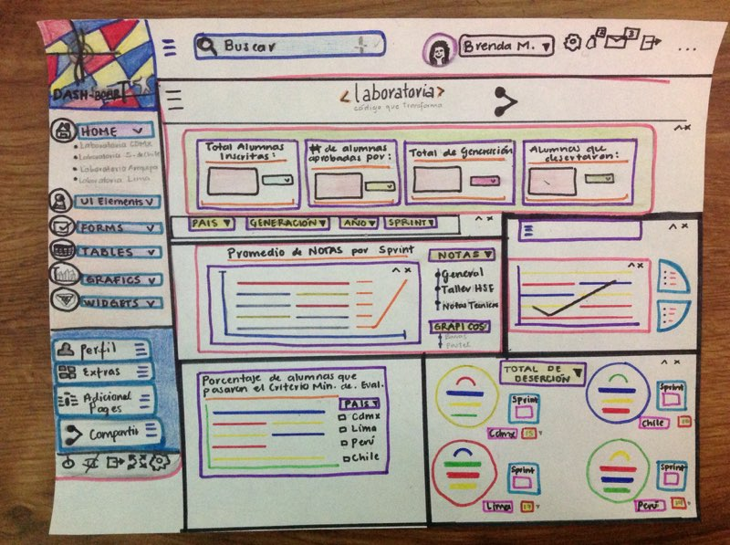

# Creando sketch para la herramienta de dashboard de Laboratoria

* **Curso:** _Creando tu primer sitio web interactivo_
* **Unidad:** _Intro a User Experience_

***
Este reto consiste en diseñar un dashboard para entender lo que sucede en cada una de las sedes de Laboratoria.

## Objetivo

Crear un dashboard que permita ver estadísticas y datos (en tiempo real) tales como:
  - Inscripciones
  - Deserción
  - Alumnas que pasan el criterio mínimo de evaluación
  - Promedio de notas (por sprint)
  - Promedio de notas HSE
  - Promedio de notas técnicas

## Flujo de trabajo

1. Investigar sobre los principales elementos que componene un dashboard

2. Entender el diseño de un dashboard, la funcionalidad y la información del mismo para así comenzar un borrador donde haremos el maquetado tomando en cuenta elementos como;

  - Usuario
  - Herramientas
  - Buscadores
  - Gráficos
  - Tablas
  - Formas
  - Configuración  

3. Identificar la data que requiere nuestro dashboard

  - número de alumnas inscritas
  - número de alumnas que desertaron
  - numero y promedi ode alumnas que pasaron el criterio mínimo de selección
  - Promedio de notas por sprint
  - Promedio de notas HSE
  - Promedio de notas técnicas

4. Diseñar dashboard.

5. Crear README.md

## Consideraciones

* El dashboard es una herramienta utilizada por profesores, training managers, directores y gerentes para entender rápidamente cierto tipo de información.

## A tener en cuenta

* Dado que Laboratoria tiene muchas generaciones, regularmente 2 generaciones por año (estas generaciones empezaron en el 2014), y que opera en 4 sedes (Arequipa, Ciudad de México, Lima y Santiago de Chile), es posible que los usuarios quieran ver datos de sedes / generaciones anteriores para poder hacer comparaciones.

## Dashboard

  > Nota:
